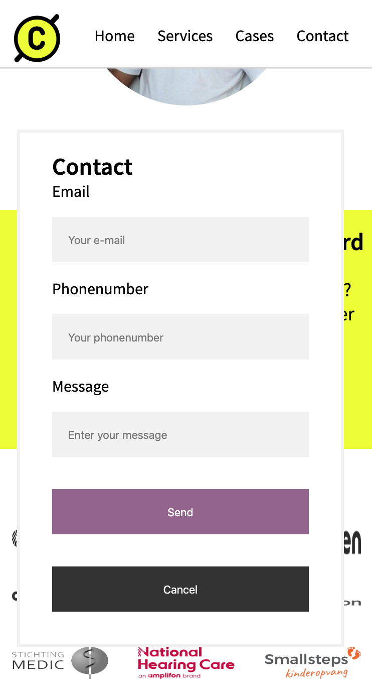
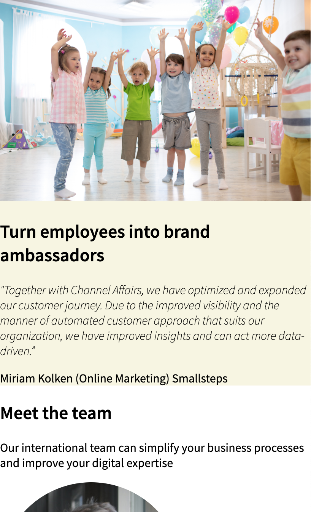
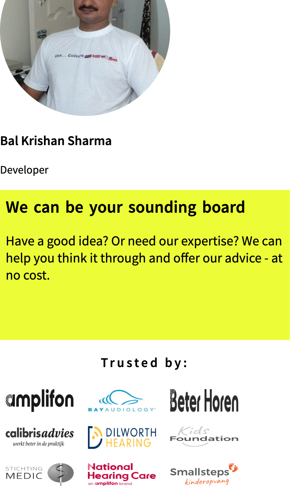

# Procesverslag
**Auteur:** Isabella Burgdorffer

Markdown cheat cheet: [Hulp bij het schrijven van Markdown](https://github.com/adam-p/markdown-here/wiki/Markdown-Cheatsheet). Nb. de standaardstructuur en de spartaanse opmaak zijn helemaal prima. Het gaat om de inhoud van je procesverslag. Besteedt de tijd voor pracht en praal aan je website.

## Bronnenlijst
1. -https://css-tricks.com/css-only-carousel/-
2. -bron 2-
3. -...-

## Eindgesprek (week 7/8)

-dit ging goed & dit was lastig-

**Screenshot(s):**

-screenshot(s) van je eindresultaat-

## Voortgang 3 (week 6)

-same as voortgang 1-

## Voortgang 2 (week 5)

### Stand van zaken

Met de hulp van Danny heb ik mijn javascript gedeelte afgekregen. Ik heb nu een pop-up field bij de contact knop onderaan de pagina. Verder heb ik op de homepagina verder gewerkt aan de styling, ik moet nu alleen nog de slider maken over de verschillende cases.

**Screenshot(s):**

### Agenda voor meeting

Voortgang gesprek planning
- Maxwidth bij grid toepassen
- De pagina refresht wanneer de pop-up wordt afgesloten
- Image on hover naar rechtsboven laten bewegen in animatie
- Site haakt af '???' halverwege

### Verslag van meeting

Het probleem met het refreshen opgelost door (action:"helpLink") toe te voegen. Lars gaf de suggestie om de pop-up niet met display:none te verbergen, maar de pop-up uit het beeld te zetten en deze zo klein mogelijk te maken. Als ik dat doe kan ik ook een animatie toevoegen wanneer de pop-up in beeld komt. Ook moet ik het aantal ID's in mijn code verminderen, het zijn er nog teveel.

## Voortgang 1 (week 3)

### Stand van zaken

Tot zover is een groot deel van de mobiele versie af. Ik moet alleen nog javascript en flexbox goed toepassen. Ik wil ook een image slider maken met informatie, maar ik weet nog niet zo goed of dat javascript is en hoe ik dat het beste kan doen. De volgende stap is om de mobiele versie te "refinen" en alles goed te laten schalen naar desktop.

**Screenshot(s):**

### Agenda voor meeting

Voortgang gesprek planning
- Flexbox; blokken naast elkaar zetten
- Pannenkoeken menu; als er op de website een is, mag je die dan namaken of moet je een andere oplossing bedenken?
- Java; 360 turn
- let keyword javascript

### Verslag van meeting

Uit de meeting is geconcludeerd dat ik voor de paarse blokken op mijn website flex kan gebruiken, alleen worden die niet responsive omdat ik de surface plane opdracht doe. 

## Intake (week 1)

**Je startniveau:** Blauw

**Je focus:** Surface plane

**Je opdracht:** https://www.channelaffairs.com/

**Screenshot(s):**

**Breakdown-schets(en):**

