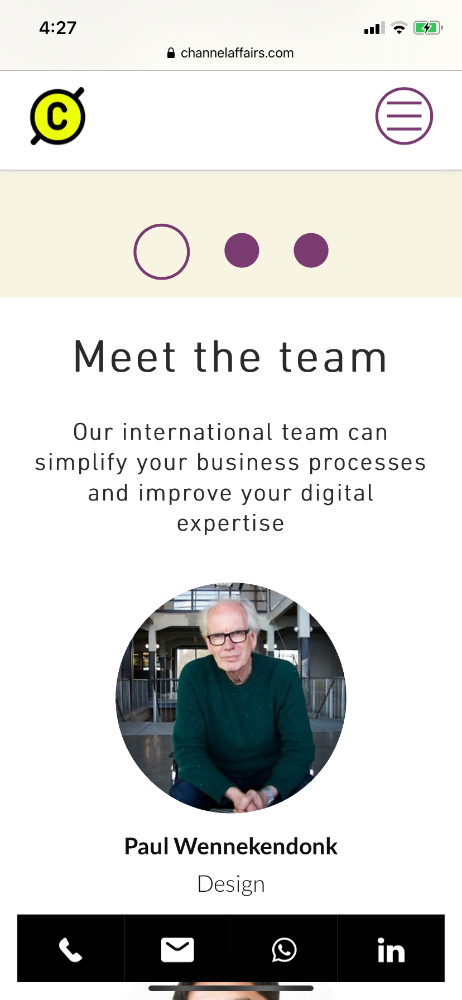
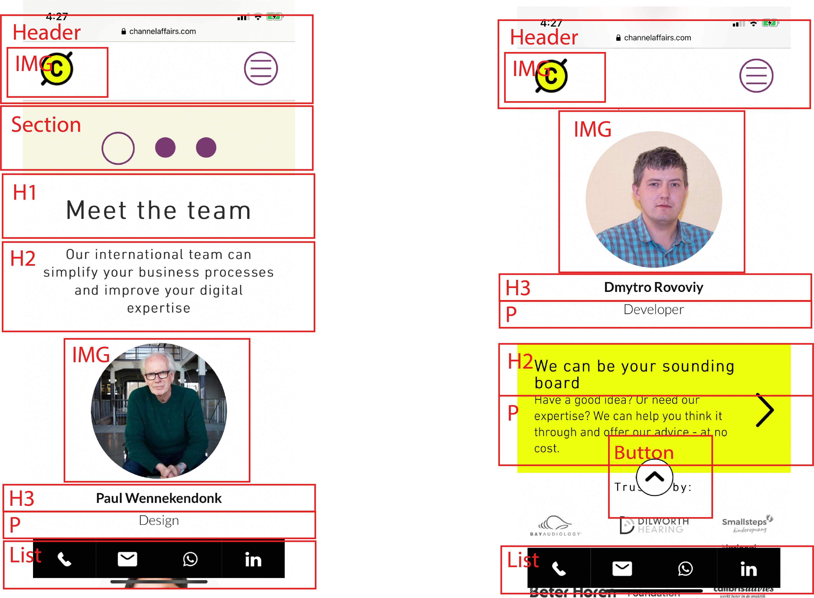

# Procesverslag
**Auteur:** Isabella Burgdorffer

Markdown cheat cheet: [Hulp bij het schrijven van Markdown](https://github.com/adam-p/markdown-here/wiki/Markdown-Cheatsheet). Nb. de standaardstructuur en de spartaanse opmaak zijn helemaal prima. Het gaat om de inhoud van je procesverslag. Besteedt de tijd voor pracht en praal aan je website.

## Bronnenlijst
1. -bron 1-
2. -bron 2-
3. -...-

## Eindgesprek (week 7/8)

-dit ging goed & dit was lastig-

**Screenshot(s):**

-screenshot(s) van je eindresultaat-

## Voortgang 3 (week 6)

-same as voortgang 1-

## Voortgang 2 (week 5)

-same as voortgang 1-

## Voortgang 1 (week 3)

### Stand van zaken

Tot zover is een groot deel van de mobiele versie af. Ik moet alleen nog javascript en flexbox goed toepassen. Ik wil ook een image slider maken met informatie, maar ik weet nog niet zo goed of dat javascript is en hoe ik dat het beste kan doen. De volgende stap is om de mobiele versie te "refinen" en alles goed te laten schalen naar desktop.

**Screenshot(s):**

(images/voortgang1_1.png)
(images/voortgang1_2.png)
(images/voortgang1_3.png)
(images/voortgang1_4.png)
(images/voortgang1_5.png)

### Agenda voor meeting

Voortgang gesprek planning
- Flexbox; blokken naast elkaar zetten
- Op Github werkt de css niet
- Image slider javascript (?)
- Pannenkoeken menu; als er op de website een is, mag je die dan namaken of moet je een andere oplossing bedenken?

### Verslag van meeting

-na afloop snel uitkomsten vastleggen-

## Intake (week 1)

**Je startniveau:** Blauw

**Je focus:** Surface plane

**Je opdracht:** https://www.channelaffairs.com/

**Screenshot(s):**

**Breakdown-schets(en):**

